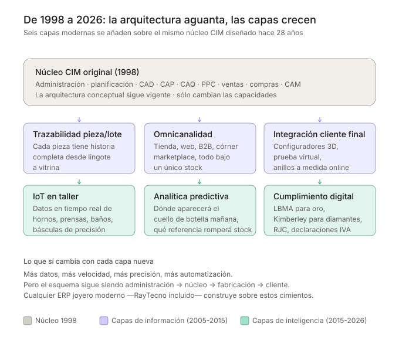

# 1998 → 2026: 28 years later, the ERP architecture of a jewelry business is still the same

> *I'm reviewing the posters I made in 1998 explaining the architecture of an integrated system for a jewelry workshop. The aesthetics are stuck in that Office 97 era. But the conceptual architecture —administration, planning, design, quality, production control, sales, purchases, manufacturing, materials flow— is exactly the same one on which RayTecno is built today.*
>
> *This is not nostalgia. It is a useful observation for any jewelry business evaluating an ERP in 2026.*

In 1998 I drew two posters to present jewelry clients with the idea of a **CIM (Computer Integrated Manufacturing) system** applied to their sector. Back then, talking about "0 stocks, 0 delays, 0 papers, total quality" in workshops where route sheets circulated stained with gold between setters and polishers sounded more like a manifesto than a technological proposal.

Almost three decades later, that proposal has ended up being the standard for any modern [jewelry ERP](/en). But —and this is the interesting part— **the conceptual scheme has not changed**. What has changed are the **technological layers** that have been piling up on top.

In this article I recover the two original diagrams (visually modernized for the web), add a third that shows what has been added between 1998 and 2026, and reflect on what this means for any jewelry business rethinking its management system today.

---

## 1. The architecture: what I drew in 1998 is still valid in 2026

The first poster was a scheme of **functional layers**: administration on top, CIM core in the center, manufacturing below, and the materials flow crossing through everything from supplier to customer.

The pieces are the same as any modern Industry 4.0 book continues to describe:

- **Administration:** accounting, personnel, industrial accounting.
- **Enterprise planning:** objectives, strategy, production framework.
- **CAD:** design, calculation, drawing, parts list, simulation.
- **CAP** (work planning) and **CAQ** (quality control).
- **PPC** (Production Planning and Control): production schedule, order release.
- **Sales and purchases** integrated into the core.
- **CAM** (Computer Aided Manufacturing): materials flow control, manufacturing control, conservation.

And a **horizontal flow** that crosses the workshop: wax → casting → exteriors → setters → polishing → finishing → shipment.

> **The important point:** this scheme was not a personal vision, it was the translation to the jewelry sector of the CIM paradigm taught in the 90s in industrial engineering schools. What was new then was that **someone seriously applied it to a jewelry workshop**, where most ran on Excel and notebooks. Today it's the basis of any serious jewelry ERP.

---

## 2. The workshop flow: sections, phases and intermediate stocks

The second poster was a radial diagram. Three concentric rings —cost centers, workshop sections, specific production phases— with gold at the core and intermediate warehouses marked radially.

What this diagram teaches, and which remains just as valid today, are three ideas that any jeweler with their own workshop will recognize:

**First: gold enters once and is transformed many times.**
The core is the raw material. Everything else is transformations that add value (and cost) on top of it. A serious jewelry ERP must measure where that value is gained and where it is lost in scrap.

**Second: there are three cost centers, not one.**
CC1, CC2 and CC3 represent groupings of sections that share a productive nature. Jewelry cost accounting doesn't work if the entire workshop is a single center: you must be able to compare the cost per gram of casting versus polishing versus stone setting.

**Third: between phases there are intermediate stocks (WIP) that no one wants to see.**
The warehouses of pilots, rubbers, waxes, stones, raw material, accessories, semi-finished and finished products are **immobilized capital** sleeping between phases. Having them explicitly identified in the diagram is what allows you to attack them: the operational question is not "how much stock do I have?" but "at what point in the flow do I have it?".

---

## 3. What has changed: six modern layers on the same core

If the conceptual architecture has not changed, what has changed then? The answer: **the capabilities**, and they have been added in the form of layers.

These are the six layers that in 1998 were not there —or were embryonic— and that today are central to any modern jewelry ERP:

### 3.1 Traceability by piece and by batch

In 1998 quality control was just another section of the CIM scheme. Today we are talking about something much more demanding: **every piece sold has a complete documented history** —from which ingot the gold came, which supplier delivered the gems, which setter worked on it, which polishing shift it went through, which controls it passed, in which store it was sold, to which customer.

This is not a whim: it is a growing regulatory requirement (LBMA, Kimberley, RJC) and an increasingly valuable commercial asset for the end customer asking "where does this diamond come from?".

### 3.2 Omnichannel

In 1998 a jewelry business sold in its store. Period. Today a medium-sized jewelry brand operates in parallel in:

- Owned stores.
- Corners and concession spaces in large retailers.
- Own website.
- Marketplaces.
- B2B wholesale distribution.
- Ephemeral events (pop-ups, fairs).

And all of that has to share **a single real stock** and a single customer history. The ERP's omnichannel layer is what makes it possible for the salesperson in a store to see that the customer bought a matching ring on the website six months ago.

### 3.3 Integration with the end customer

Online 3D configurators, virtual try-on with augmented reality, custom rings ordered from mobile, quotes shared via WhatsApp with photos of workshop progress. The end customer is no longer just the destination of the flow: they are **another actor within the flow**, with the capacity to initiate manufacturing orders that enter directly into the system.

### 3.4 IoT in the workshop

In 1998 manufacturing control was fed by paper reports that the foreman typed at the end of the shift. In 2026 data comes directly from the equipment:

- Casting furnaces that report temperature and cycle curve in real time.
- Connected precision scales that record the weight of each piece in each phase.
- Rhodium baths with automated thickness control.
- Cameras that document the state of the piece at each critical point.

The ERP receives machine data without human intervention. The consequence: frictionless traceability, and the ability to detect anomalies (abnormal scrap, out-of-range cycles) before they become a problem.

### 3.5 Predictive analytics

The ERPs of the 90s answered the question *"what happened?"*. Modern ERPs also answer *"what is going to happen?"*. Applied to jewelry:

- **Bottleneck prediction:** knowing the current workshop load, which phase will saturate first next week.
- **Stockout prediction by store:** combining history, seasonality and specific events (campaigns, weather, local holidays).
- **Demand prediction by collection:** detecting before intuition which references will take off.

This layer is only possible when traceability and IoT are in place: predictive analytics needs clean and abundant historical data to train.

### 3.6 Digital regulatory compliance

In 1998 regulatory obligations were simpler and were managed on paper. In 2026 a jewelry business faces:

- **LBMA** (London Bullion Market Association) for responsible gold certification.
- **Kimberley Process** for conflict-free diamonds.
- **RJC** (Responsible Jewellery Council) for comprehensive chain certification.
- **Digital VAT declarations** (SII in Spain, European equivalents).
- **Suspicious operations registry** (AML for precious metals).
- **Mandatory electronic invoicing** according to regulatory evolution.

This layer is not optional: it is a condition for operating. And it is only viable if it is integrated into the ERP, not as a later addition.

---

## 4. The conclusion that matters: the architecture is stable, the capabilities evolve

Looking at two posters from 1998 and verifying that the architecture remains intact is not a nostalgic exercise. It has a **direct practical implication** for any jewelry business evaluating its ERP today.

**The right question is not "does this ERP have AI / blockchain / IoT?"**. That question leads to buying modern layers mounted on fragile architectures.

**The right question is: "does this ERP respect the natural architecture of the jewelry business —administration, planning, CAD, quality, production control, sales, purchases, manufacturing, materials flow— and build the modern layers on top of it?"**.

If the answer is yes, the new layers that are invented over the next 28 years will be able to continue being added without breaking the system. If the answer is no, no AI module will save the system when the workshop grows or regulations change.

At **RayTecno** we approach it exactly this way with [RayGold](/en): the core is the classic CIM jewelry architecture, proven for decades; the modern layers (traceability, omnichannel, IoT, analytics, compliance) are modules that activate as each jewelry business needs.. A small jewelry business starts with the core. A jewelry group with its own production and twenty stores activates all the layers.

The architecture is the promise that your ERP will not become obsolete when the next wave of technology arrives. And the next one is already arriving.

If your jewelry business has its own workshop, store network or both, and wants to review its management system with this architectural lens instead of a feature checklist, [let's talk](https://www.raytecno.es/contact).

---

### Further reading

- *Supplying jewelry stores: how to decide how much product to send to each point of sale*
- *Types of business organization in the jewelry sector: Mintzberg's 5 configurations*
- *The Schneider case: 5 strategic marketing lessons applicable to jewelry*

---

**Did you find this article useful?** Share it with your management team or subscribe to the RayTecno blog to receive a monthly strategic analysis.

---

*Author's note: the original 1998 posters are kept in my personal archive. These diagrams are modernized recreations that respect the conceptual architecture of the original, visually adapted for the web.*
