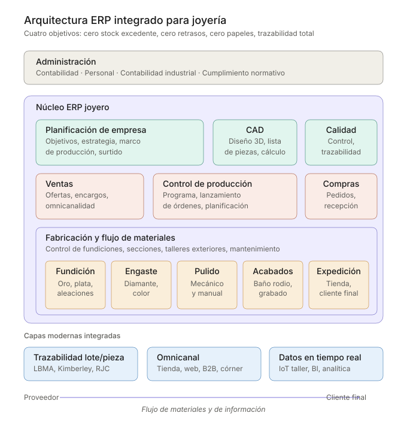

# 1998 → 2026 : 28 ans plus tard, l'architecture ERP d'une joaillerie reste la même

> *Je revois les posters que j'ai faits en 1998 expliquant l'architecture d'un système intégré pour atelier de joaillerie. L'esthétique est restée ancrée dans cet Office 97. Mais l'architecture conceptuelle —administration, planification, conception, qualité, contrôle de production, ventes, achats, fabrication, flux de matériaux— est exactement la même sur laquelle se construit RayTecno aujourd'hui.*
>
> *Ce n'est pas de la nostalgie. C'est une observation utile pour toute joaillerie qui évalue un ERP en 2026.*

En 1998 j'ai dessiné deux posters pour présenter à des clients joailliers l'idée d'un **système CIM (Computer Integrated Manufacturing)** appliqué à leur secteur. À l'époque, parler de « 0 stocks, 0 retards, 0 papiers, qualité totale » dans des ateliers où les feuilles de route circulaient tachées d'or entre sertisseurs et polisseurs sonnait plus comme un manifeste que comme une proposition technologique.

Près de trois décennies plus tard, cette proposition a fini par devenir le standard de tout [ERP joaillerie](/fr) moderne. Mais —et c'est l'intéressant— **le schéma conceptuel n'a pas changé**. Ce qui a changé, ce sont les **couches technologiques** qui se sont empilées dessus.

Dans cet article, je reprends les deux diagrammes originaux (modernisés visuellement pour le web), j'en ajoute un troisième qui montre ce qui a été ajouté entre 1998 et 2026, et je réfléchis à ce que cela signifie pour toute joaillerie qui repense aujourd'hui son système de gestion.

---

## 1. L'architecture : ce que j'ai dessiné en 1998 reste valide en 2026

Le premier poster était un schéma de **couches fonctionnelles** : administration en haut, noyau CIM au centre, fabrication en bas, et le flux de matériaux traversant le tout du fournisseur au client.

Les pièces sont les mêmes que tout livre moderne d'Industrie 4.0 continue de décrire :

- **Administration :** comptabilité, personnel, comptabilité industrielle.
- **Planification d'entreprise :** objectifs, stratégie, cadre de production.
- **CAO :** conception, calcul, dessin, liste de pièces, simulation.
- **CAP** (planification du travail) et **CAQ** (contrôle qualité).
- **PPC** (Production Planning and Control) : programme de production, lancement d'ordres.
- **Ventes et achats** intégrés au noyau.
- **CAM** (Computer Aided Manufacturing) : contrôle de flux de matériaux, contrôle de fabrication, conservation.

Et un **flux horizontal** qui traverse l'atelier : cire → fonte → extérieurs → sertisseurs → polissages → finitions → expédition.

> **Le point important :** ce schéma n'était pas une vision personnelle, c'était la traduction au secteur joaillier du paradigme CIM enseigné dans les années 90 dans les écoles d'ingénierie industrielle. Ce qui était nouveau alors, c'est que **quelqu'un l'applique sérieusement à un atelier de joaillerie**, où la majorité travaillait avec Excel et un carnet. Aujourd'hui c'est la base de tout ERP joaillier sérieux.

---

## 2. Le flux de l'atelier : sections, phases et stocks intermédiaires

Le second poster était un diagramme radial. Trois anneaux concentriques —centres de coût, sections de l'atelier, phases productives concrètes— avec l'or au noyau et les magasins intermédiaires marqués radialement.

Ce que ce diagramme enseigne, et qui reste tout aussi valide aujourd'hui, ce sont trois idées que tout joaillier avec atelier propre reconnaîtra :

**Première : l'or entre une fois et se transforme plusieurs fois.**
Le noyau est la matière première. Tout le reste, ce sont des transformations qui ajoutent de la valeur (et du coût) sur elle. Un ERP joaillier sérieux doit mesurer où cette valeur est gagnée et où elle est perdue en pertes.

**Deuxième : il y a trois centres de coût, pas un.**
CC1, CC2 et CC3 représentent des regroupements de sections qui partagent une nature productive. La comptabilité de coûts joaillère ne fonctionne pas si tout l'atelier est un unique centre : il faut pouvoir comparer le coût par gramme de la fonte face au polissage face au sertissage.

**Troisième : entre les phases il y a des stocks intermédiaires (WIP) que personne ne veut voir.**
Les magasins de pilotes, caoutchoucs, cires, pierres, matière première, accessoires, semi-finis et finis sont du **capital immobilisé** dormant entre les phases. Les avoir identifiés explicitement dans le diagramme est ce qui permet de les attaquer : la question opérationnelle n'est pas « combien de stock ai-je ? » mais « à quel point du flux l'ai-je ? ».

---

## 3. Ce qui a changé : six couches modernes sur le même noyau

Si l'architecture conceptuelle n'a pas changé, qu'est-ce qui a changé alors ? La réponse : **les capacités**, et elles ont été ajoutées sous forme de couches.

Voici les six couches qui en 1998 n'étaient pas là —ou étaient embryonnaires— et qui aujourd'hui sont centrales dans tout ERP joaillier moderne :

### 3.1 Traçabilité par pièce et par lot

En 1998 le contrôle qualité était une section de plus du schéma CIM. Aujourd'hui nous parlons de quelque chose de bien plus exigeant : **chaque pièce vendue a une histoire complète documentée** —de quel lingot vient l'or, quel fournisseur a livré les gemmes, quel sertisseur l'a travaillée, quel poste de polissage elle a traversé, quels contrôles elle a passés, dans quelle boutique elle a été vendue, à quel client.

Ce n'est pas un caprice : c'est une exigence réglementaire croissante (LBMA, Kimberley, RJC) et un actif commercial de plus en plus précieux pour le client final qui demande « d'où vient ce diamant ? ».

### 3.2 Omnicanalité

En 1998 une joaillerie vendait dans sa boutique. Point. Aujourd'hui une marque joaillère moyenne opère en parallèle dans :

- Boutiques propres.
- Corners et espaces concédés en grandes surfaces.
- Site web propre.
- Marketplaces.
- Distribution grossiste B2B.
- Événements éphémères (pop-ups, salons).

Et tout cela doit partager **un seul stock réel** et un seul historique client. La couche omnicanale de l'ERP est ce qui rend possible que la vendeuse d'une boutique voie que la cliente a acheté une bague assortie sur le web il y a six mois.

### 3.3 Intégration avec le client final

Configurateurs 3D en ligne, essai virtuel avec réalité augmentée, bagues sur mesure commandées depuis le mobile, devis partagés par WhatsApp avec photos de l'avancement de l'atelier. Le client final n'est plus seulement la destination du flux : c'est **un acteur de plus dans le flux**, avec la capacité d'initier des ordres de fabrication qui entrent directement dans le système.

### 3.4 IoT à l'atelier

En 1998 le contrôle de fabrication s'alimentait de comptes-rendus papier que le responsable saisissait à la fin du poste. En 2026 les données viennent directement des équipements :

- Fours de fonte qui rapportent température et courbe du cycle en temps réel.
- Balances de précision connectées qui enregistrent le poids de chaque pièce à chaque phase.
- Bains de rhodium avec contrôle d'épaisseur automatisé.
- Caméras qui documentent l'état de la pièce à chaque point critique.

L'ERP reçoit des données machine sans intervention humaine. La conséquence : traçabilité sans friction, et la possibilité de détecter des anomalies (pertes anormales, cycles hors plage) avant qu'elles ne deviennent un problème.

### 3.5 Analytique prédictive

Les ERP des années 90 répondaient à la question *« que s'est-il passé ? »*. Les ERP modernes répondent aussi à *« que va-t-il se passer ? »*. Appliqué à la joaillerie :

- **Prédiction de goulots d'étranglement :** sachant la charge actuelle de l'atelier, quelle phase saturera la première la semaine prochaine.
- **Prédiction de rupture de stock par boutique :** combinant historique, saisonnalité et événements ponctuels (campagnes, climat, jours fériés locaux).
- **Prédiction de demande par collection :** détectant avant l'intuition quelles références vont décoller.

Cette couche n'est possible que lorsque la traçabilité et l'IoT sont en place : l'analytique prédictive a besoin de données historiques propres et abondantes pour s'entraîner.

### 3.6 Conformité réglementaire numérique

En 1998 les obligations réglementaires étaient plus simples et se géraient sur papier. En 2026 une joaillerie fait face à :

- **LBMA** (London Bullion Market Association) pour la certification d'or responsable.
- **Processus Kimberley** pour les diamants libres de conflit.
- **RJC** (Responsible Jewellery Council) pour la certification intégrale de la chaîne.
- **Déclarations TVA numériques** (SII en Espagne, équivalents européens).
- **Registre d'opérations suspectes** (AML/LCB-FT pour les métaux précieux).
- **Facturation électronique obligatoire** selon l'évolution réglementaire.

Cette couche n'est pas optionnelle : c'est une condition pour opérer. Et elle n'est viable que si elle est intégrée dans l'ERP, pas comme ajout ultérieur.

---

## 4. La conclusion qui compte : l'architecture est stable, les capacités évoluent

Regarder deux posters de 1998 et vérifier que l'architecture reste intacte n'est pas un exercice nostalgique. Cela a une **implication pratique directe** pour toute joaillerie évaluant aujourd'hui son ERP.

**La bonne question n'est pas « cet ERP a-t-il IA / blockchain / IoT ? »**. Cette question mène à acheter des couches modernes montées sur des architectures fragiles.

**La bonne question est : « cet ERP respecte-t-il l'architecture naturelle du métier joaillier —administration, planification, CAO, qualité, contrôle de production, ventes, achats, fabrication, flux de matériaux— et construit-il les couches modernes par-dessus ? »**.

Si la réponse est oui, les nouvelles couches qui s'inventeront au cours des 28 prochaines années pourront continuer à s'ajouter sans casser le système. Si la réponse est non, aucun module d'IA ne sauvera le système quand l'atelier grandira ou que les réglementations changeront.

Chez **RayTecno** nous le concevons exactement ainsi avec [RayGold](/fr) : le noyau est l'architecture classique du CIM joaillier, éprouvée pendant des décennies ; les couches modernes (traçabilité, omnicanal, IoT, analytique, conformité) sont des modules qui s'activent selon les besoins de chaque joaillerie. Une petite joaillerie commence par le noyau. Un groupe joaillier avec production propre et vingt boutiques active toutes les couches.

L'architecture est la promesse que votre ERP ne deviendra pas obsolète quand arrivera la prochaine vague de technologie. Et la prochaine arrive déjà.

Si votre joaillerie a un atelier propre, un réseau de boutiques ou les deux, et veut réviser son système de gestion avec cette lentille architecturale au lieu d'une checklist de fonctionnalités, [parlons-en](https://www.raytecno.es/contact).

---

### Pour continuer la lecture

- *Approvisionnement aux boutiques de joaillerie : comment décider combien de produit envoyer à chaque point de vente*
- *Types d'organisation entrepreneuriale dans le secteur joaillier : les 5 configurations de Mintzberg*
- *Le cas Schneider : 5 leçons de marketing stratégique applicables à la joaillerie*

---

**Cet article vous a-t-il été utile ?** Partagez-le avec votre équipe de direction ou abonnez-vous au blog RayTecno pour recevoir une analyse stratégique par mois.

---

*Note de l'auteur : les posters originaux de 1998 sont conservés dans mes archives personnelles. Ces diagrammes sont des recréations modernisées qui respectent l'architecture conceptuelle de l'original, adaptée visuellement pour le web.*
