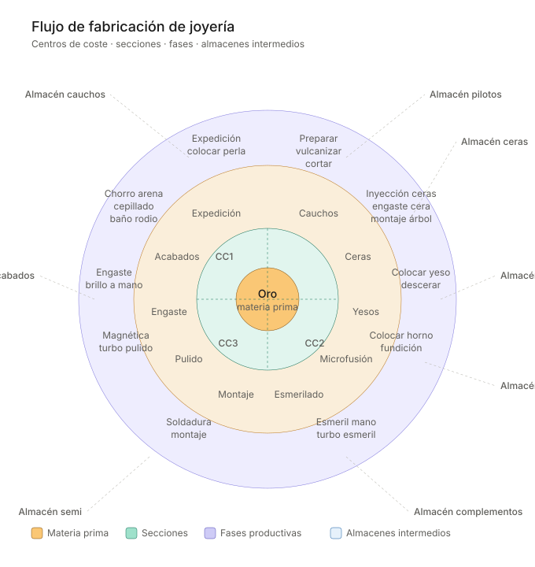

# 1998 → 2026: 28 anos depois, a arquitetura ERP de uma joalheria continua sendo a mesma

> *Reviso os pôsteres que fiz em 1998 explicando a arquitetura de um sistema integrado para oficina de joalheria. A estética ficou ancorada naquele Office 97. Mas a arquitetura conceitual —administração, planejamento, design, qualidade, controle de produção, vendas, compras, fabricação, fluxo de materiais— é exatamente a mesma sobre a qual o RayGold se constrói hoje.*
>
> *Isto não é nostalgia. É uma observação útil para qualquer joalheria que esteja avaliando um ERP em 2026.*

Em 1998 desenhei dois pôsteres para apresentar a clientes joalheiros a ideia de um **sistema CIM (Computer Integrated Manufacturing)** aplicado ao seu setor. Naquela época, falar de "0 estoque, 0 atrasos, 0 papéis, qualidade total" em oficinas onde as folhas de rota circulavam manchadas de ouro entre cravadores e polidores soava mais a manifesto do que a proposta tecnológica.

Quase três décadas depois, essa proposta acabou sendo o padrão de qualquer [ERP joalheiro](https://www.raytecno.es/es/erp-joyeria) moderno. Mas —e isto é o interessante— **o esquema conceitual não mudou**. O que mudou foram as **camadas tecnológicas** que foram se empilhando por cima.

Neste artigo recupero os dois diagramas originais (modernizados visualmente para a web), acrescento um terceiro que mostra o que se somou entre 1998 e 2026, e reflito sobre o que isso significa para qualquer joalheria que esteja repensando hoje o seu sistema de gestão.

---

## 1. A arquitetura: o que desenhei em 1998 continua válido em 2026

O primeiro pôster era um esquema de **camadas funcionais**: administração no topo, núcleo CIM no centro, fabricação embaixo, e o fluxo de materiais atravessando tudo de fornecedor a cliente.

As peças são as mesmas que qualquer livro moderno de Indústria 4.0 continua descrevendo: administração (contabilidade, pessoal, contabilidade industrial); planejamento de empresa (objetivos, estratégia, marco de produção); CAD (design, cálculo, desenho, lista de peças, simulação); CAP (planejamento de trabalho) e CAQ (controle de qualidade); PPC (Production Planning and Control: programa de produção, lançamento de ordens); vendas e compras integrados ao núcleo; e CAM (Computer Aided Manufacturing: controle de fluxo de materiais, controle de fabricação, manutenção).

E um **fluxo horizontal** que atravessa a oficina: cera → fundição → trabalhos externos → cravadores → polimentos → acabamentos → expedição.

> **O ponto importante:** este esquema não era uma visão própria, era a tradução para o setor joalheiro do paradigma CIM ensinado nos anos 90 nas escolas de engenharia industrial. O que de fato era novidade na época é que **alguém o aplicasse a sério a uma oficina de joalheria**, onde a maioria trabalhava com Excel e caderno. Hoje é a base de qualquer ERP joalheiro sério.

---

## 2. O fluxo da oficina: seções, fases e estoques intermediários

O segundo pôster era um diagrama radial. Três anéis concêntricos —centros de custo, seções da oficina, fases produtivas concretas— com o ouro no núcleo e os armazéns intermediários marcados radialmente.

O que este diagrama ensina, e que continua igualmente válido hoje, são três ideias que qualquer joalheiro com oficina própria reconhecerá:

**Primeira: o ouro entra uma vez e se transforma muitas.**
O núcleo é a matéria-prima. Todo o resto são transformações que agregam valor (e custo) sobre ela. Um ERP joalheiro sério precisa medir onde esse valor se ganha e onde se perde em perdas.

**Segunda: há três centros de custo, não um.**
CC1, CC2 e CC3 representam agrupamentos de seções que compartilham natureza produtiva. A contabilidade de custos joalheira não funciona se toda a oficina for um único centro: é preciso poder comparar o custo por grama da fundição frente ao polimento frente à cravação.

**Terceira: entre as fases há estoques intermediários (WIP) que ninguém quer ver.**
Os armazéns de modelos-piloto, borrachas, ceras, pedras, matéria-prima, componentes, semielaborados e acabados são **capital imobilizado** dormindo entre as fases. Tê-los identificados explicitamente no diagrama é o que permite atacá-los: a pergunta operacional não é "quanto estoque tenho?" mas "em que ponto do fluxo eu o tenho?".

---

## 3. O que mudou: seis camadas modernas sobre o mesmo núcleo

Se a arquitetura conceitual não mudou, o que mudou então? A resposta: **as capacidades**, acrescentadas em forma de camadas.

Estas são as seis camadas que em 1998 não existiam —ou eram embrionárias— e que hoje são centrais em qualquer ERP joalheiro moderno:

### 3.1 Rastreabilidade por peça e por lote

Em 1998 o controle de qualidade era mais uma seção do esquema CIM. Hoje falamos de algo muito mais exigente: **cada peça vendida tem uma história completa documentada** —de qual lingote saiu o ouro, qual fornecedor entregou as gemas, qual cravador a trabalhou, por qual turno de polimento passou, quais controles superou, em qual loja foi vendida, a qual cliente.

Isto não é um capricho: é uma exigência normativa crescente (LBMA, Kimberley, RJC) e um ativo comercial cada vez mais valioso para o cliente final que pergunta "de onde vem este diamante?".

### 3.2 Omnicanalidade

Em 1998 uma joalheria vendia na sua loja. Ponto. Hoje uma marca joalheira média opera em paralelo nas suas próprias lojas, corners e espaços concedidos em grandes superfícies, site próprio, marketplaces, distribuição atacadista B2B e eventos efêmeros (pop-ups, feiras).

E tudo isso precisa compartilhar **um único estoque real** e um único histórico de cliente. A camada omnicanal do ERP é o que torna possível que a vendedora de uma loja veja que a cliente comprou um anel combinando pela web há seis meses.

### 3.3 Integração com o cliente final

Configuradores 3D online, prova virtual com realidade aumentada, anéis sob medida pedidos pelo celular, orçamentos compartilhados por WhatsApp com fotos do andamento da oficina. O cliente final já não é apenas o destino do fluxo: é **mais um ator dentro do fluxo**, com capacidade de iniciar ordens de fabricação que entram diretamente no sistema.

### 3.4 IoT na oficina

Em 1998 o controle de fabricação era alimentado por folhas em papel que o encarregado digitava no fim do turno. Em 2026 os dados vêm diretamente dos equipamentos: fornos de fundição que reportam temperatura e curva do ciclo em tempo real, balanças de precisão conectadas que registram o peso de cada peça em cada fase, banhos de ródio com controle de espessura automatizado, câmeras que documentam o estado da peça em cada ponto crítico.

O ERP recebe dados de máquina sem intervenção humana. A consequência: rastreabilidade sem atrito, e a possibilidade de detectar anomalias (perdas anormais, ciclos fora da faixa) antes que se tornem um problema.

### 3.5 Analítica preditiva

Os ERPs dos anos 90 respondiam à pergunta *"o que aconteceu?"*. Os ERPs modernos respondem também *"o que vai acontecer?"*. Aplicado à joalheria: previsão de gargalos (sabendo a carga atual da oficina, qual fase saturará primeiro na semana que vem), previsão de ruptura de estoque por loja (combinando histórico, sazonalidade e eventos pontuais) e previsão de demanda por coleção (detectando antes da intuição quais referências vão decolar).

Esta camada só é possível quando a rastreabilidade e o IoT estão no lugar: a analítica preditiva precisa de dados históricos limpos e abundantes para treinar.

### 3.6 Conformidade normativa digital

Em 1998 as obrigações normativas eram mais simples e se geriam em papel. Em 2026 uma joalheria enfrenta: LBMA (certificação de ouro responsável), Processo de Kimberley (diamantes livres de conflito), RJC (certificação integral da cadeia), declarações de impostos digitais (SII na Espanha e equivalentes europeus), registro de operações suspeitas (prevenção à lavagem de dinheiro para metais preciosos) e faturamento eletrônico obrigatório conforme a evolução regulatória, como o VERI*FACTU.

Esta camada não é opcional: é condição para operar. E só é viável se estiver integrada ao ERP, não como um acréscimo posterior.

---

## 4. A conclusão que importa: a arquitetura é estável, as capacidades evoluem

Olhar dois pôsteres de 1998 e verificar que a arquitetura continua intacta não é um exercício nostálgico. Tem uma **implicação prática direta** para qualquer joalheria que esteja avaliando o seu ERP hoje.

**A pergunta correta não é "este ERP tem IA / blockchain / IoT?"**. Essa pergunta leva a comprar camadas modernas montadas sobre arquiteturas frágeis.

**A pergunta correta é: "este ERP respeita a arquitetura natural do negócio joalheiro —administração, planejamento, CAD, qualidade, controle de produção, vendas, compras, fabricação, fluxo de materiais— e constrói as camadas modernas sobre ela?"**.

Se a resposta for sim, as novas camadas que se inventem nos próximos 28 anos poderão continuar sendo acrescentadas sem quebrar o sistema. Se a resposta for não, nenhum módulo de IA salvará o sistema quando a oficina crescer ou as normativas mudarem.

No RayGold abordamos exatamente assim: o núcleo é a arquitetura clássica do CIM joalheiro, comprovada durante décadas; as camadas modernas (rastreabilidade, omnicanal, IoT, analítica, conformidade) são módulos que se ativam conforme a necessidade de cada joalheria. Uma joalheria pequena começa pelo núcleo. Um grupo joalheiro com produção própria e vinte lojas ativa todas as camadas.

A arquitetura é a promessa de que o seu ERP não ficará obsoleto quando chegar a próxima onda de tecnologia. E a próxima já está chegando.

Se a sua joalheria tem oficina própria, rede de lojas ou ambas, e você quer revisar o seu sistema de gestão por essa lente arquitetônica em vez de por uma checklist de funcionalidades, [vamos conversar](https://www.raytecno.es/pt-br/contato).

---

**Este artigo foi útil para você?** Compartilhe-o com a sua equipe diretiva.

---

*Nota do autor: os pôsteres originais de 1998 estão guardados no meu arquivo pessoal. Estes diagramas são recriações modernizadas que respeitam a arquitetura conceitual do original, adaptada visualmente para a web.*